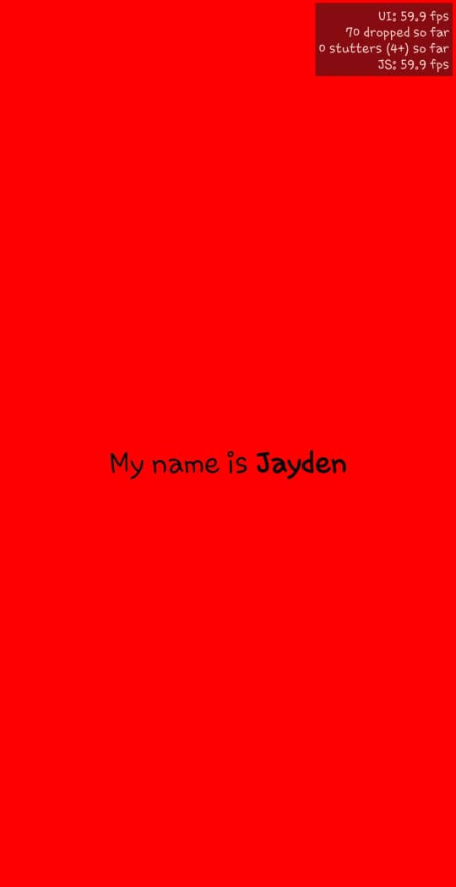

# React Native Assignment 2

## Description
This assignment is a simple React Native application created using Expo CLI. The app displays the text "My name is YourName" with "YourName" in bold and a font size of 24. The background color of the main view is set to red.

## Screenshot
!

## Student ID
11252890

## How to Run
1. Clone the repository.
2. Navigate to the project directory.
3. Run `npm start` to start the development server.
4. Follow the instructions to open the app in an emulator or on a physical device using the Expo Go app.
